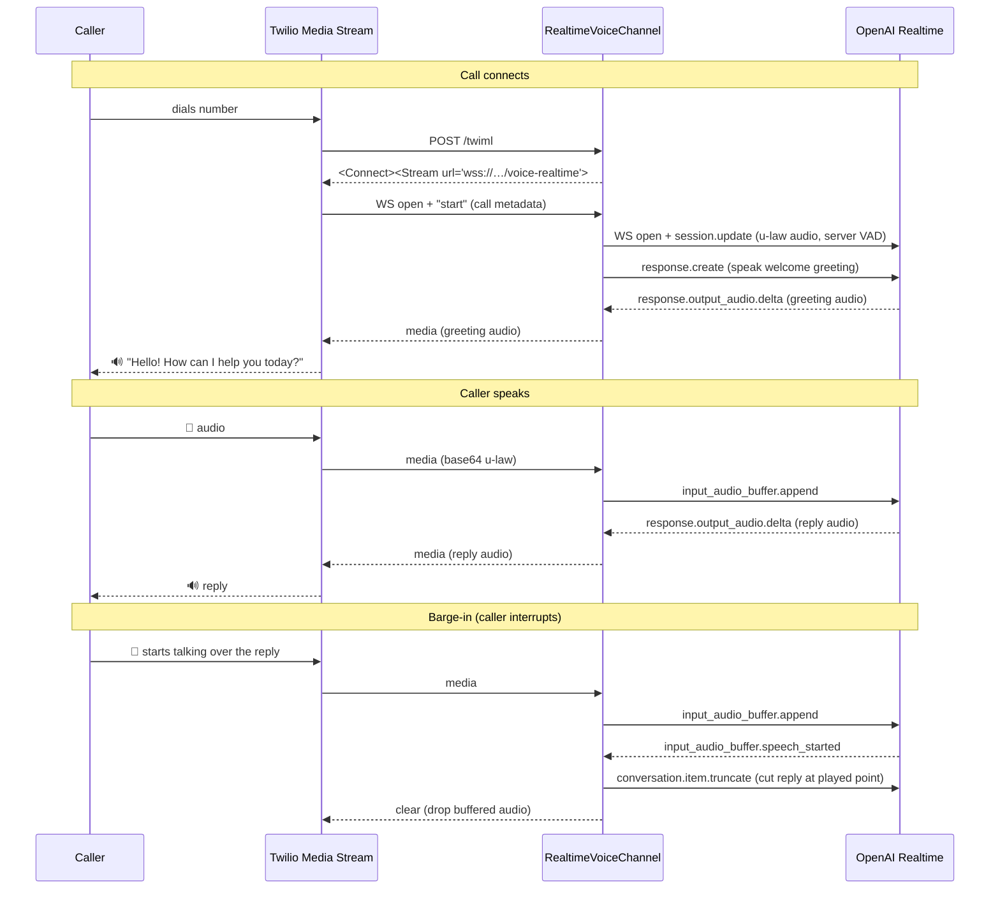

# Realtime Voice (speech-to-speech) — POC

A voice channel that connects a phone caller directly to a **speech-to-speech**
model (OpenAI Realtime) over **Twilio Media Streams**.

## Why

TAC's existing `VoiceChannel` uses Twilio **ConversationRelay**: Twilio does the
speech-to-text and text-to-speech, and your app handles a *text* turn in between.
That's great for reusing a text LLM, but it adds latency and loses vocal nuance
(tone, interruptions, timing).

This channel takes the other approach: it hands **raw audio** straight to a model
that listens and speaks natively. The model does its own transcription, reasoning,
speech synthesis, and turn detection, so the result is lower-latency, more natural
conversation with real barge-in (the caller can interrupt the assistant).

| | `VoiceChannel` (ConversationRelay) | `RealtimeVoiceChannel` (this) |
|---|---|---|
| Protocol | text | audio |
| STT / TTS | Twilio | the model |
| Your app handles | a text turn (`on_message_ready`) | nothing — it's a pure audio bridge |
| Best for | reusing an existing text agent | lowest latency, most natural voice |

## How it works

The channel sits between two WebSockets and relays audio in both directions —
it never touches text.



1. **TwiML** — Twilio hits `POST /twiml`; we return
   `<Connect><Stream>` pointing at our WebSocket.
2. **Connect** — On the stream's `start` event we open a WebSocket to OpenAI
   Realtime, configure the session (u-law audio to match telephony; server-side
   voice-activity detection), and — if a welcome greeting is set — ask the model
   to greet the caller first.
3. **Bridge** — Each caller `media` frame → `input_audio_buffer.append`; each
   model `response.output_audio.delta` → Twilio `media`.
4. **Barge-in** — When the caller talks over the assistant, OpenAI emits
   `input_audio_buffer.speech_started`; we truncate the in-flight reply at the
   point actually played and clear Twilio's buffer so it stops immediately.

## Code layout

| Path | What |
|---|---|
| `src/tac/channels/realtime/channel.py` | `RealtimeVoiceChannel` — the audio bridge |
| `src/tac/channels/realtime/config.py` | `RealtimeVoiceChannelConfig` — model, voice, instructions, greeting |
| `src/tac/channels/realtime/twiml.py` | `generate_stream_twiml` — the `<Connect><Stream>` TwiML |
| `src/tac/server/realtime_server.py` | `RealtimeVoiceServer` — batteries-included FastAPI host |
| `getting_started/examples/features/voice_realtime.py` | runnable example |

## Run it

```bash
pip install 'twilio-agent-connect[server,realtime]'
uv run python getting_started/examples/features/voice_realtime.py
```

Required env vars:

- `TWILIO_ACCOUNT_SID`, `TWILIO_AUTH_TOKEN`, `TWILIO_API_KEY`, `TWILIO_API_SECRET`
- `TWILIO_PHONE_NUMBER`
- `TWILIO_VOICE_PUBLIC_DOMAIN` — public host Twilio can reach (e.g. an ngrok domain)
- `OPENAI_API_KEY`

Optional: `OPENAI_REALTIME_MODEL` (default `gpt-realtime`),
`OPENAI_REALTIME_VOICE` (default `ash`).

Then point your Twilio number's **voice webhook** at
`https://<your-domain>/twiml` and call the number.

## Status & limitations (POC)

- **First version.** Voice bridge + barge-in + English greeting only.
- **No memory yet** — caller memory/profile injection is intentionally out of
  scope for this POC.
- **WebSocket upgrade is not signature-validated** (the TwiML request is). Fine
  for testing; revisit before production.
- **Single instance** — conversation state is tracked in-process, like the other
  channels.
