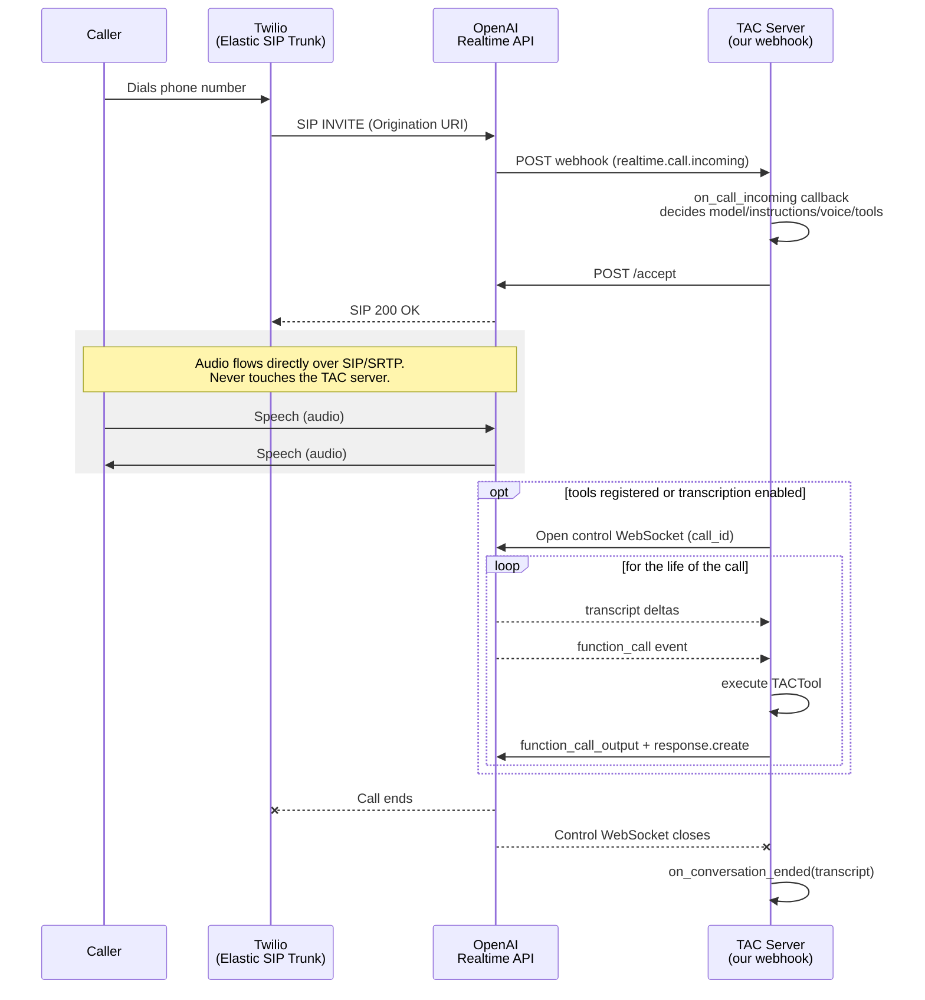
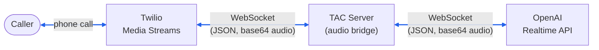
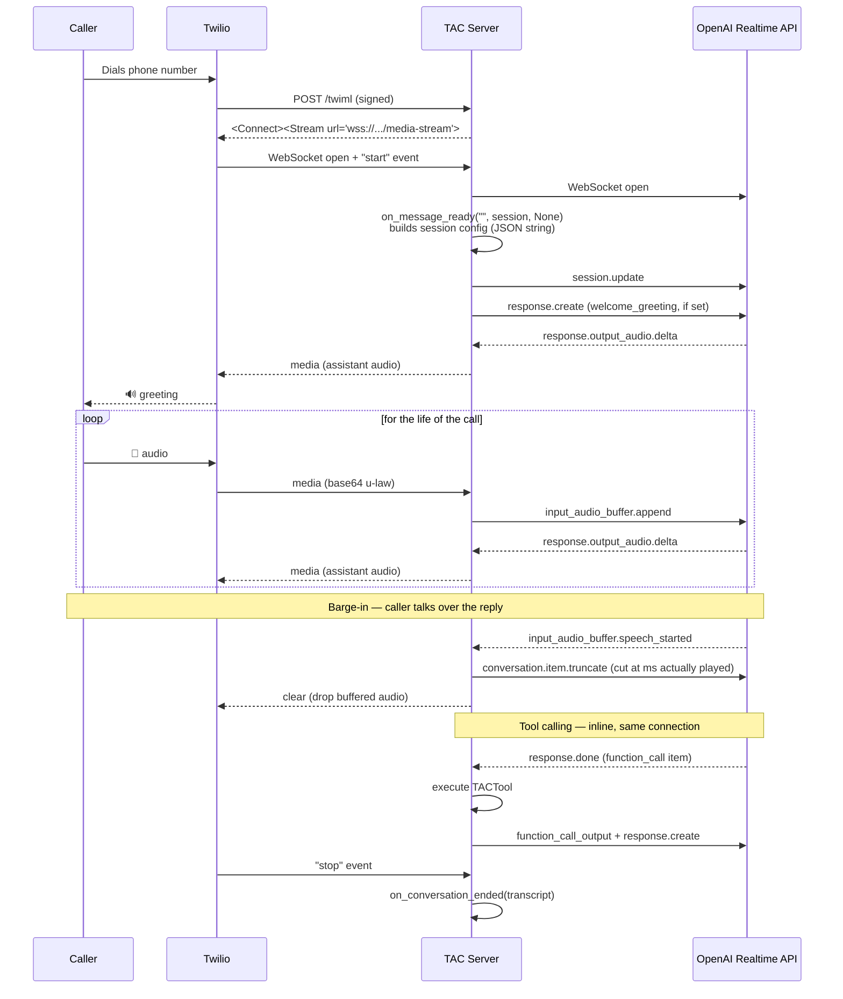

# TAC + Speech-to-Speech (S2S) POC

This document tracks the exploration of adding native speech-to-speech (S2S)
voice support to TAC, alongside the existing ConversationRelay-based
`VoiceChannel`. TAC's existing voice channel is cascaded (Twilio does
STT/TTS, TAC sees text turns); S2S providers instead listen to and produce
audio directly, with no intermediate transcription step.

Planned sections:

1. **OpenAI Realtime API via Twilio SIP Trunking** — Twilio forwards the call
   to OpenAI at the SIP level; audio never touches our server.
2. **OpenAI Realtime API via Twilio Media Streams** — audio bridged through
   our own server instead of a SIP hand-off.
3. *(planned)* TBD — a third S2S approach/provider.

---

## Section 1: OpenAI Realtime API + Twilio SIP Trunking

Implemented as `OpenAIRealtimeSipChannel` (`src/tac/channels/openai_realtime_sip/`).

### 1. Architecture

Twilio's Elastic SIP Trunking forwards the call directly to OpenAI at the SIP
level. Our server is never in the audio path — it only handles the
`realtime.call.incoming` webhook (to decide whether/how to accept the call)
and, optionally, a JSON-only "sideband" WebSocket for transcript capture and
tool calling.

At a component level:


And the corresponding call flow over time:



Key point: **the audio path and the control path are two entirely separate
connections.** Media (SIP/SRTP) is negotiated and carried directly between
Twilio and OpenAI's infrastructure. The control WebSocket, when used, carries
only JSON events — no audio bytes ever cross it.

### 2. Setup

#### OpenAI side

1. `platform.openai.com/settings` → **Webhooks** → create a webhook:
   - Event type: `realtime.call.incoming`
   - URL: your public server + webhook path (default `/openai/incoming-call`)
   - Save the **webhook secret** — needed to verify incoming webhooks.
2. `platform.openai.com/settings` → **General** → note your **Project ID**
   (`proj_xxxxx`).

#### Twilio side

1. Buy a Voice-capable phone number.
2. **Elastic SIP Trunking** → create a trunk.
3. On the trunk, add an **Origination URI**:
   ```
   sip:proj_xxxxx@sip.api.openai.com;transport=tls
   ```
   (EU data residency: `sip-eu.api.openai.com`)
4. Enable **Secure Trunking** (`secure: true`) on the trunk.
5. Attach the phone number to the trunk.

#### Environment variables

```
TWILIO_ACCOUNT_SID / TWILIO_AUTH_TOKEN / TWILIO_API_KEY / TWILIO_API_SECRET
TWILIO_PHONE_NUMBER      # TAC requires it even though this channel doesn't use it directly
OPENAI_API_KEY
OPENAI_WEBHOOK_SECRET
```

`TWILIO_CONVERSATION_CONFIGURATION_ID` should be **unset** — this channel
doesn't use Conversation Orchestrator or Memory.

### 3. Pros and cons

**Pros**

- Audio never touches our server — no binary frame handling, no
  audio-streaming infrastructure to build or run.
- Fits TAC's existing webhook → callback → decision lifecycle almost
  exactly, unlike a media bridge which needs a mostly-new lifecycle.
- True S2S: no cascaded STT → LLM → TTS latency chain.

**Cons**

- No access to the audio itself: no custom recording, no custom VAD, no
  injecting or mixing external audio.
- Debugging failures at the SIP layer is opaque: errors surface as a bare
  SIP response code (e.g. `400 Bad Request`) with no application-level
  detail, and there's no dashboard purpose-built for this integration on
  either side.
- Tightly coupled to OpenAI's specific Realtime-over-SIP feature and
  Twilio's Elastic SIP Trunking semantics; a Media Streams-based bridge
  (Section 2) is a more portable pattern if a second S2S provider is
  added later.

---

## Section 2: OpenAI Realtime API + Twilio Media Streams

Implemented as `OpenAIRealtimeMediaStreamsChannel`
(`src/tac/channels/openai_realtime_media_streams/`).

### 1. Architecture

Twilio streams call audio to our own WebSocket (`<Connect><Stream>`) instead
of handing the call to OpenAI directly. This channel relays that audio to a
second WebSocket connection it opens to OpenAI's Realtime API, and back —
unlike Section 1, our server sits directly in the audio path for the life of
the call.



Both legs carry the *same* transport shape — JSON messages with base64-encoded
audio payloads, never raw binary frames — so `WebSocketProtocol`'s existing
`receive_json`/`send_text` interface needed no changes to support this.

The call flow over time:



Two consequences of being in the audio path ourselves, both verified against
a real call:

- **Barge-in is precise, not just "stop everything."** Because we relay every
  audio delta ourselves, we track exactly how many ms of the assistant's
  reply Twilio has actually played (`latest_media_timestamp -
  response_start_timestamp`) and tell OpenAI to truncate the reply at that
  exact point via `conversation.item.truncate`, then clear Twilio's leftover
  buffer. Section 1 has no equivalent — barge-in there is entirely OpenAI's
  own VAD/turn-detection behavior, with no hook for us to intervene.
- **Transcript and tool calling are inline**, on the one connection we're
  already holding open — no separate sideband WebSocket to stand up, unlike
  Section 1.

### 2. Setup

#### Twilio side

1. Buy (or reuse) a Voice-capable phone number.
2. Point its **Voice webhook** at your public tunnel + TwiML path (default
   `/twiml`) — an ordinary Voice URL, not a SIP Trunk.

#### Environment variables

```
TWILIO_ACCOUNT_SID / TWILIO_AUTH_TOKEN / TWILIO_API_KEY / TWILIO_API_SECRET
TWILIO_PHONE_NUMBER
TWILIO_VOICE_PUBLIC_DOMAIN   # public host Twilio can reach (e.g. an ngrok domain)
OPENAI_API_KEY
```

`TWILIO_CONVERSATION_CONFIGURATION_ID` should be **unset**, same as Section 1
— this channel doesn't use Conversation Orchestrator or Memory either.

### 3. Pros and cons

**Pros**

- Full control over the audio path — precise barge-in, and the door is open
  for custom recording, mixing, or audio-layer processing if ever needed.
- Twilio-side setup is simpler than Section 1 — just a Voice URL, no Elastic
  SIP Trunk to provision.
- Transcript and tool calling are inline on the connection we already hold
  open — no extra sideband connection to manage.

**Cons**

- Our server is now in the audio critical path for the whole call — its
  availability and latency directly affect call quality, unlike Section 1
  where our server's involvement ends at `/accept`.
- We own the audio-bridging complexity: two WebSocket connections per call to
  keep in sync, barge-in bookkeeping, and the various "response.done doesn't
  mean Twilio finished playing" timing gotchas worked out in
  `OpenAIRealtimeMediaStreamsChannel`.
- More portable across S2S providers in principle (any provider accepting a
  WebSocket audio stream could sit on the OpenAI side of this bridge), but
  that portability isn't exercised yet — only OpenAI has been implemented.
